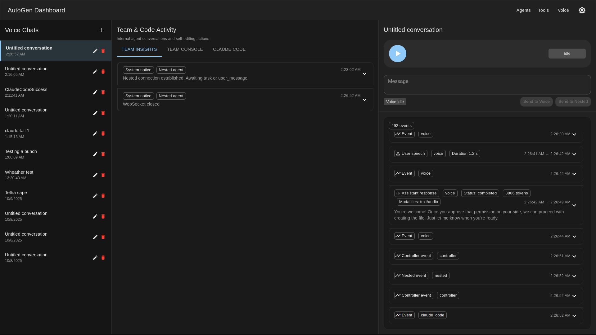
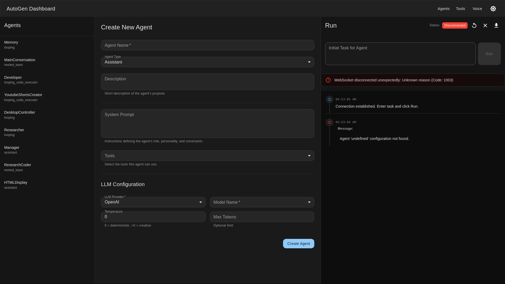

# Agentic AI System

> **A new way to create, debug, and interact with AI agents.**

Traditional agent frameworks require coding expertise, complex configurations, and tedious debugging cycles. **Agentic changes that.** With an intuitive visual editor, real-time execution monitoring, and voice-controlled orchestration, you can build powerful multi-agent systems in minutes—not hours.

**The Goal:** Provide a seamless UI/UX for creating, managing, debugging, and interacting with intelligent agents that can operate anything. From web research to code generation, from data analysis to self-improvement—all controlled through natural conversation or visual workflows.

Build once. Deploy anywhere. Control with your voice.

---

**Core Capabilities:**
- 🎨 **Visual Agent Studio** - Design agents with drag-and-drop simplicity
- 🎙️ **Voice-First Control** - Speak to orchestrate complex multi-agent workflows
- 🔍 **Real-Time Debugging** - Watch agents think, act, and learn in real-time
- 🤖 **Multi-Agent Teams** - Coordinate specialist agents for complex tasks
- ✏️ **Self-Editing System** - Agents that improve their own codebase
- 🛠️ **Extensible by Design** - Custom tools, models, and integrations



---

## 🚀 Why Agentic?

### **Traditional Approach** ❌
```python
# Write complex configurations
agent_config = {
    "llm_config": {...},
    "tools": [...],
    "system_message": "...",
    # 100+ lines of boilerplate
}

# Debug by reading logs
# No visibility into agent reasoning
# Restart after every change
# No team coordination
```

### **Agentic Approach** ✅
```
1. Open the visual editor
2. Name your agent → Select tools → Write prompt
3. Click "Run" → Watch it execute in real-time
4. Say "improve the search results" → Agent adapts
5. Voice control for instant orchestration
```

**The difference:** What takes hours in traditional frameworks takes **minutes** in Agentic.

---

## ✨ Features

### 🎙️ **Real-time Voice Assistant**
- Voice interaction using OpenAI Realtime API with WebRTC
- Live audio visualization and transcription
- Dual-mode operation: Team delegation and Claude Code self-editing
- Persistent conversation history with SQLite storage
- Natural language control of multi-agent workflows

### 🎨 **Visual Agent Editor & Dashboard**
- **Full-featured agent editor** with real-time validation
- **Three-panel interface:** Agent list, configuration editor, execution console
- **Drag-and-drop tool selection** from available tools library
- **Live execution monitoring** with WebSocket event streaming
- **Multi-agent team builder** for nested coordination
- **JSON import/export** for agent configurations
- **Template system** for quick agent creation
- Support for OpenAI, Anthropic, and Google models

### 🤖 **Multi-Agent Team System**
- Nested team coordination with AutoGen framework
- Dynamic agent orchestration (selector/broadcast modes)
- Real-time event streaming to UI
- Custom tool integration per agent
- Team hierarchy with specialized roles
- Shared or isolated memory per agent

### ✏️ **Claude Code Self-Editor**
- Live codebase modification through voice commands
- Real-time event visualization (tool calls, file edits, bash commands)
- JSON streaming I/O with Claude CLI
- Isolated subprocess management
- Self-improving system capabilities

### 🛠️ **Extensible Tool System**
- Web search and content fetching
- Memory management (short-term and vector-based long-term)
- Code execution and file operations
- Custom tool creation framework
- Auto-loading of tools from `backend/tools/`
- Type-safe tool definitions with Pydantic

### 📊 **Rich Dashboard Interface**
- Material-UI based React application
- Agent configuration and management
- Real-time WebSocket event streams
- Multi-tab views: Team Insights, Console, Claude Code
- Dark/light mode support
- Responsive design for desktop and tablet

### 🔧 **Developer Tools**
- Screenshot automation for UI development
- Database export for conversation analysis
- Comprehensive logging system
- Hot reload for backend and frontend
- REST API with OpenAPI documentation
- WebSocket debugging tools

---

## 🎯 What Can You Build?

**Research Assistants** 🔬
> "Search for the latest papers on quantum computing, analyze the top 5, and save key findings to memory."
→ Agents autonomously search, read, analyze, and remember information.

**Development Teams** 👨‍💻
> "Create a REST API for user authentication with JWT tokens."
→ Product Manager → Architect → Developer → Tester (coordinated workflow)

**Data Analysts** 📊
> "Fetch sales data from the last quarter, calculate trends, and generate a summary report."
→ Agents retrieve data, perform calculations, and create insights.

**Content Creators** ✍️
> "Write a blog post about the latest AI developments, include 5 external sources."
→ Research → Outline → Draft → Edit → Publish pipeline

**Self-Improving Systems** 🔄
> "Add a new API endpoint for exporting reports to PDF."
→ Claude Code modifies the codebase, adds tests, updates documentation.

**The limit is your imagination.** If it can be described in natural language, Agentic can orchestrate agents to accomplish it.

---

## 📋 Table of Contents

- [Quick Start](#quick-start)
- [Why Agentic](#why-agentic)
- [What Can You Build](#what-can-you-build)
- [Installation Methods](#installation-methods)
  - [Automated Installation](#automated-installation)
  - [Manual Installation](#manual-installation)
- [Configuration](#configuration)
- [Usage](#usage)
  - [Voice Assistant Interface](#voice-assistant-interface)
  - [Agent Dashboard & Editor](#agent-dashboard--editor)
  - [Creating Custom Tools](#creating-custom-tools)
- [Project Structure](#project-structure)
- [Development](#development)
- [Debugging](#debugging)
- [Architecture](#architecture)
- [API Reference](#api-reference)
- [Troubleshooting](#troubleshooting)

---

## 🚀 Quick Start

### Prerequisites

- **Node.js** >= 20.0.0
- **Python** >= 3.9.0
- **pip** package manager
- **API Keys**: OpenAI and Anthropic

### Automated Installation

```bash
# Clone or navigate to the project
cd /path/to/agentic

# Run installation script
./install.sh

# Configure API keys
nano backend/.env

# Start all services
./run_all.sh
```

### Access the Application

- **Frontend:** http://localhost:3000
- **Voice Assistant:** http://localhost:3000/voice
- **API Docs:** http://localhost:8000/docs
- **Backend API:** http://localhost:8000

---

## 📦 Installation Methods

### Automated Installation

The automated installation script handles dependency checking and environment setup:

```bash
./install.sh
```

**What it does:**

1. **Checks dependencies:**
   - Node.js >= 20.0.0
   - Python >= 3.9.0
   - pip package manager
   - Python venv module

2. **Environment setup strategy:**
   - **All dependencies present + venv available:** Creates Python virtual environment (`venv/`)
   - **Missing Node.js or Python:** Installs Miniconda and creates conda environment
   - **Missing venv module:** Falls back to conda environment

3. **Installs packages:**
   - Python dependencies from `backend/requirements.txt`
   - Frontend Node.js packages
   - Debug tool dependencies

4. **Creates configuration:**
   - `.env` template in `backend/.env`
   - Executable run scripts (`run_all.sh`, `run_backend.sh`, `run_frontend.sh`)

### Manual Installation

If you prefer manual control over the installation process:

#### Option 1: Using Python venv (Recommended if you have Node.js >= 20 and Python >= 3.9)

```bash
# 1. Create Python virtual environment
python3 -m venv venv

# 2. Activate virtual environment
source venv/bin/activate

# 3. Install Python dependencies
cd backend
pip install -r requirements.txt
cd ..

# 4. Install frontend dependencies (uses system Node.js)
cd frontend
npm install
cd ..

# 5. Install debug tools
cd _debug
npm install
cd ..

# 6. Create .env file
cat > backend/.env << 'EOF'
OPENAI_API_KEY=your_openai_api_key_here
ANTHROPIC_API_KEY=your_anthropic_api_key_here
GOOGLE_API_KEY=your_google_api_key_here
DATABASE_PATH=voice_conversations.db
HOST=0.0.0.0
PORT=8000
EOF

# 7. Make run scripts executable
chmod +x run_backend.sh run_frontend.sh run_all.sh
```

#### Option 2: Using Conda

```bash
# 1. Create conda environment with Python 3.11 and Node.js 20
conda create -n agentic python=3.11 nodejs=20 -y

# 2. Activate environment
conda activate agentic

# 3. Install Python dependencies
cd backend
pip install -r requirements.txt
cd ..

# 4. Install frontend dependencies
cd frontend
npm install
cd ..

# 5. Install debug tools
cd _debug
npm install
cd ..

# 6. Create .env file
cat > backend/.env << 'EOF'
OPENAI_API_KEY=your_openai_api_key_here
ANTHROPIC_API_KEY=your_anthropic_api_key_here
GOOGLE_API_KEY=your_google_api_key_here
DATABASE_PATH=voice_conversations.db
HOST=0.0.0.0
PORT=8000
EOF

# 7. Make run scripts executable
chmod +x run_backend.sh run_frontend.sh run_all.sh
```

#### Option 3: Using System Python and Node.js

```bash
# 1. Verify versions
node --version    # Should be >= 20.0.0
python3 --version # Should be >= 3.9.0

# 2. Install Python dependencies
cd backend
pip3 install -r requirements.txt
cd ..

# 3. Install frontend dependencies
cd frontend
npm install
cd ..

# 4. Install debug tools
cd _debug
npm install
cd ..

# 5. Create .env file
cat > backend/.env << 'EOF'
OPENAI_API_KEY=your_openai_api_key_here
ANTHROPIC_API_KEY=your_anthropic_api_key_here
GOOGLE_API_KEY=your_google_api_key_here
DATABASE_PATH=voice_conversations.db
HOST=0.0.0.0
PORT=8000
EOF

# 6. Make run scripts executable
chmod +x run_backend.sh run_frontend.sh run_all.sh
```

---

## ⚙️ Configuration

### Required API Keys

Edit `backend/.env` and add your API keys:

```env
# Required for voice assistant and agents
OPENAI_API_KEY=sk-...

# Required for Claude Code self-editor
ANTHROPIC_API_KEY=sk-ant-...

# Optional for web search functionality
GOOGLE_API_KEY=...
```

### Optional Configuration

```env
# Database path for voice conversations
DATABASE_PATH=voice_conversations.db

# Server configuration
HOST=0.0.0.0
PORT=8000

# Logging level
LOG_LEVEL=INFO
```

### Claude Code Requirements

The self-editing feature requires the Claude CLI to be installed:

```bash
# Install Claude CLI (if not already installed)
npm install -g @anthropic-ai/claude-sdk

# Verify installation
claude --version
```

---

## 🎯 Usage

### Running the Application

**Start both backend and frontend:**
```bash
./run_all.sh
```

**Start services separately:**
```bash
# Terminal 1 - Backend
./run_backend.sh

# Terminal 2 - Frontend
./run_frontend.sh
```

**Logs location:**
- Backend: `logs/backend.log` (when using `run_all.sh`)
- Frontend: `logs/frontend.log` (when using `run_all.sh`)

### Voice Assistant Interface

1. Navigate to http://localhost:3000/voice
2. Click **"Start Session"** button
3. Allow microphone access when prompted
4. Speak your request naturally

**Example voice commands:**

- *"Create a new API endpoint for user authentication"* → Delegates to nested team
- *"Add a new React component for displaying charts"* → Claude Code edits frontend
- *"Search for the latest Python best practices"* → Uses web search tool
- *"Remember that our database uses PostgreSQL 15"* → Saves to memory

**Voice Assistant Features:**

- **Audio Visualization:** Real-time waveform during conversation
- **Session Controls:** Start, pause, cancel sessions
- **Three-tab View:**
  - **Team Insights:** Highlights from nested team agent actions
  - **Team Console:** Full event stream and raw messages
  - **Claude Code:** Tool calls, file edits, and bash commands from Claude

### Agent Dashboard & Editor

The agent dashboard provides a comprehensive interface for creating, editing, and managing AI agents with a powerful visual editor.



#### Dashboard Features

**Three-Panel Layout:**
1. **Left Panel** - Agent list with quick navigation
2. **Center Panel** - Full-featured agent editor
3. **Right Panel** - Live execution console with real-time results

**Agent Management:**
- Create new agents from scratch or templates
- Edit existing agent configurations
- Delete agents with confirmation
- Real-time validation and error checking
- Unsaved changes warning

#### Creating an Agent

1. Navigate to http://localhost:3000/agents
2. Click **"Create New Agent"** button in the left panel
3. Configure agent in the center editor panel
4. Click **"Save Agent"** to persist configuration
5. Click **"Run Agent"** to test execution

#### Agent Editor Components

**1. Basic Configuration**
```
Name:         [Unique identifier for the agent]
Agent Type:   [looping | nested_team | assistant]
Description:  [Optional description of agent purpose]
```

**2. LLM Configuration**
```
Provider:     [openai | anthropic | google]
Model:        [Select from available models or enter custom]
Temperature:  [0.0 - 2.0] Controls randomness
Max Tokens:   [Optional token limit for responses]
```

**Supported Models by Provider:**
- **OpenAI:** gpt-4-turbo, gpt-4, gpt-3.5-turbo, gpt-4o-mini
- **Anthropic:** claude-3-opus, claude-3-sonnet, claude-3-haiku
- **Google:** gemini-pro, gemini-1.5-pro

**3. Tool Selection**
- **Multi-select dropdown** with all available tools
- **Visual chips** showing selected tools
- **Remove tool** by clicking X on chip
- **Tool categories:**
  - Web tools (search, fetch content)
  - Memory tools (short-term, long-term)
  - Code execution tools
  - Custom tools (auto-loaded from `backend/tools/`)

**4. System Prompt Configuration**
```
System Prompt:  [Define agent personality and behavior]
User Prompt:    [Initial task or query]
```

**Prompt Tips:**
- Be specific about the agent's role and capabilities
- Include tool usage guidelines if needed
- Mention output format expectations
- Reference any constraints or limitations

**5. Advanced Settings**

**For Looping Agents:**
```
Tool Call Loop:           [✓] Enable continuous tool calling
Reflect on Tool Use:      [✓] Agent reflects before using tools
Max Consecutive Replies:  [20] Limit to prevent infinite loops
Model Client Stream:      [✓] Enable streaming responses
```

**For Nested Team Agents:**
```
Sub-Agents:               [Select multiple agents for the team]
Orchestrator Mode:        [selector | broadcast]
Orchestrator Agent:       [Manager] Name of coordinating agent
Orchestrator Pattern:     [NEXT AGENT: <Name>] Response parsing pattern
```

#### Orchestration Modes

**Selector Mode:**
- Orchestrator chooses ONE agent per turn
- Best for sequential, specialized tasks
- Example: Manager → Researcher → Writer → Reviewer

**Broadcast Mode:**
- All agents receive the message simultaneously
- Best for parallel analysis or consensus building
- Example: Multiple experts providing different perspectives

#### Agent Editor Workflow

**Creating a Research Agent:**

1. **Set Basic Info:**
   ```
   Name: ResearchAssistant
   Type: looping
   Description: Conducts web research and stores findings
   ```

2. **Configure LLM:**
   ```
   Provider: openai
   Model: gpt-4-turbo
   Temperature: 0.7
   Max Tokens: 4000
   ```

3. **Select Tools:**
   - ✓ web_search
   - ✓ fetch_web_content
   - ✓ save_to_long_term_memory
   - ✓ retrieve_similar_memories

4. **Write System Prompt:**
   ```
   You are a research assistant that finds, analyzes, and remembers information.

   When given a research topic:
   1. Use web_search to find relevant sources
   2. Use fetch_web_content to read full articles
   3. Analyze and synthesize the information
   4. Save key findings to long-term memory with descriptive tags
   5. Provide a comprehensive summary with sources

   Always cite your sources and tag memories appropriately.
   ```

5. **Set User Prompt:**
   ```
   Research the latest developments in AI agent architectures and multi-agent systems.
   Focus on papers from 2024-2025.
   ```

6. **Configure Advanced Settings:**
   ```
   Tool Call Loop: ✓
   Reflect on Tool Use: ✓
   Max Consecutive Replies: 20
   ```

7. **Save and Test:**
   - Click "Save Agent" (top right)
   - Click "Run Agent" to execute
   - Monitor results in right panel console

#### Nested Team Configuration Example

**Creating a Software Development Team:**

1. **First, create individual agents:**
   - `ProductManager` - Requirements analysis
   - `Architect` - System design
   - `Developer` - Code implementation
   - `Tester` - Quality assurance

2. **Create team coordinator:**
   ```
   Name: DevTeam
   Type: nested_team
   Sub-Agents: [ProductManager, Architect, Developer, Tester]
   Orchestrator Mode: selector
   Orchestrator Agent: ProductManager
   ```

3. **System Prompt for Orchestrator:**
   ```
   You are a product manager coordinating a development team.

   Team members:
   - Architect: Designs system architecture
   - Developer: Implements features
   - Tester: Validates functionality

   For each task:
   1. Analyze requirements
   2. Delegate to appropriate team member
   3. Review their output
   4. Continue until task is complete

   Use "NEXT AGENT: <Name>" to delegate tasks.
   ```

#### Real-time Execution Console

The right panel shows live execution with:

**Event Stream:**
- **TextMessage** - Agent responses and reasoning
- **ToolCallRequestEvent** - Tool invocations with arguments
- **ToolCallExecutionEvent** - Tool results
- **TaskResult** - Final outcome

**Console Features:**
- Auto-scroll to latest events
- Collapsible event details
- JSON formatting for structured data
- Color-coded event types
- Timestamp for each event
- Source identification (which agent)

**Example Console Output:**
```
[2025-10-10 14:23:15] TextMessage (ResearchAssistant)
"I'll search for recent papers on AI agent architectures..."

[2025-10-10 14:23:16] ToolCallRequestEvent
Tool: web_search
Arguments: {
  "query": "AI agent architectures 2024 2025",
  "num_results": 10
}

[2025-10-10 14:23:18] ToolCallExecutionEvent
Result: [10 search results with titles and URLs]

[2025-10-10 14:23:19] TextMessage (ResearchAssistant)
"Found several relevant papers. Let me fetch the most promising one..."

[2025-10-10 14:23:20] ToolCallRequestEvent
Tool: fetch_web_content
Arguments: {"url": "https://..."}

[2025-10-10 14:23:22] TaskResult
Status: completed
Summary: "Research complete. Saved 5 key findings to long-term memory."
```

#### Agent Editor Tips

**Best Practices:**

1. **Start Simple:**
   - Create a basic looping agent first
   - Test with 1-2 tools
   - Add complexity incrementally

2. **Tool Selection:**
   - Only include tools the agent actually needs
   - Too many tools can confuse the LLM
   - Group related functionality

3. **Prompt Engineering:**
   - Be explicit about tool usage
   - Provide step-by-step workflows
   - Include examples in system prompt
   - Mention when to TERMINATE

4. **Testing Strategy:**
   - Use the console to debug behavior
   - Watch tool call sequences
   - Adjust prompts based on results
   - Monitor token usage

5. **Nested Teams:**
   - Create and test individual agents first
   - Ensure clear role separation
   - Use selector mode for most use cases
   - Provide orchestrator with clear delegation syntax

6. **Error Handling:**
   - Editor validates configuration in real-time
   - Red indicators show required fields
   - Hover over errors for details
   - Can't save until all errors resolved

#### Keyboard Shortcuts

- **Ctrl+S** - Save agent (when in editor)
- **Ctrl+Enter** - Run agent
- **Esc** - Cancel running agent
- **Ctrl+/** - Toggle JSON view

#### JSON Import/Export

**Export Configuration:**
```bash
# Via API
curl http://localhost:8000/api/agents/ResearchAssistant > research_assistant.json
```

**Import Configuration:**
```bash
# Via API
curl -X POST http://localhost:8000/api/agents \
  -H "Content-Type: application/json" \
  -d @research_assistant.json
```

**Complete Agent JSON Example:**

```json
{
  "name": "ResearchAssistant",
  "agent_type": "looping",
  "description": "Conducts web research and stores findings in memory",
  "tools": [
    "web_search",
    "fetch_web_content",
    "save_to_long_term_memory",
    "retrieve_similar_memories"
  ],
  "llm": {
    "provider": "openai",
    "model": "gpt-4-turbo",
    "temperature": 0.7,
    "max_tokens": 4000
  },
  "prompt": {
    "system": "You are a research assistant that finds, analyzes, and remembers information.\n\nWhen given a research topic:\n1. Use web_search to find relevant sources\n2. Use fetch_web_content to read full articles\n3. Analyze and synthesize the information\n4. Save key findings to long-term memory with descriptive tags\n5. Provide a comprehensive summary with sources\n\nAlways cite your sources and tag memories appropriately.\n\nWhen complete, respond with TERMINATE.",
    "user": "Research the latest developments in AI agent architectures"
  },
  "tool_call_loop": true,
  "reflect_on_tool_use": true,
  "max_consecutive_auto_reply": 20,
  "model_client_stream": false
}
```

### Creating Custom Tools

Tools are Python functions with type annotations and descriptions:

1. **Create tool file:** `backend/tools/my_custom_tool.py`

```python
from pydantic import BaseModel, Field
from autogen_core.tools import FunctionTool
from typing import Optional

def calculate_statistics(
    numbers: list[float],
    operation: str = "mean"
) -> dict:
    """
    Calculate statistics on a list of numbers.

    Args:
        numbers: List of numbers to analyze
        operation: Type of statistic (mean, median, sum, min, max)

    Returns:
        Dictionary with the result
    """
    import statistics

    operations = {
        "mean": statistics.mean,
        "median": statistics.median,
        "sum": sum,
        "min": min,
        "max": max
    }

    if operation not in operations:
        return {"error": f"Unknown operation: {operation}"}

    try:
        result = operations[operation](numbers)
        return {
            "operation": operation,
            "result": result,
            "count": len(numbers)
        }
    except Exception as e:
        return {"error": str(e)}

# Export as FunctionTool
calculate_statistics_tool = FunctionTool(
    func=calculate_statistics,
    name="calculate_statistics",
    description="Calculate statistics (mean, median, sum, min, max) on a list of numbers"
)

# Tools list (required)
tools = [calculate_statistics_tool]
```

2. **Tool is automatically loaded** on backend restart
3. **Use in agents** by adding `"calculate_statistics"` to tools list

### Memory System

Agents can use short-term and long-term memory:

**Short-term memory** (in-conversation):
```python
# Save
save_to_short_term_memory("User prefers TypeScript over JavaScript")

# Retrieve
get_short_term_memory()
```

**Long-term memory** (ChromaDB vector store):
```python
# Save with tags
save_to_long_term_memory(
    content="PostgreSQL 15 connection string format",
    tags=["database", "postgres", "config"]
)

# Retrieve similar
retrieve_similar_memories(
    query="How do I connect to postgres?",
    top_k=3,
    tags=["database"]
)
```

---

## 📁 Project Structure

```
agentic/
├── backend/                      # FastAPI backend server
│   ├── agents/                   # Agent JSON configurations
│   │   ├── nested_team.json     # Multi-agent team config
│   │   └── *.json               # Custom agent configs
│   ├── tools/                    # Custom tool implementations
│   │   ├── web_tools.py         # Web search & fetch
│   │   ├── memory_tools.py      # Memory management
│   │   └── *.py                 # Custom tools
│   ├── scripts/                  # Utility scripts
│   │   └── export_voice_conversations.py
│   ├── main.py                   # FastAPI application
│   ├── runner.py                 # Agent execution engine
│   ├── agent_factory.py          # Agent creation factory
│   ├── realtime_voice.py         # Voice assistant controller
│   ├── voice_controller.py       # Voice session management
│   ├── claude_code_controller.py # Claude Code integration
│   ├── nested_agent.py           # Nested team implementation
│   ├── requirements.txt          # Python dependencies
│   └── .env                      # Environment variables (create this)
│
├── frontend/                     # React 18 application
│   ├── public/                   # Static assets
│   ├── src/
│   │   ├── components/           # Reusable React components
│   │   │   ├── AudioVisualizer.js
│   │   │   ├── ClaudeCodeInsights.js
│   │   │   ├── NestedAgentInsights.js
│   │   │   └── VoiceSessionControls.js
│   │   ├── pages/                # Page components
│   │   │   ├── VoiceAssistant.js # Voice UI (main interface)
│   │   │   ├── AgentDashboard.js # Agent management
│   │   │   └── HomePage.js       # Landing page
│   │   ├── api.js                # API client functions
│   │   ├── App.js                # Main app component
│   │   └── index.js              # Entry point
│   ├── package.json              # Node.js dependencies
│   └── package-lock.json
│
├── _debug/                       # Development tools
│   ├── screenshot.js             # Puppeteer screenshot automation
│   ├── screenshots/              # Screenshot storage
│   │   └── readme/               # README screenshots
│   ├── package.json              # Debug tool dependencies
│   └── AUTOMATED_UI_DEVELOPMENT.md
│
├── logs/                         # Application logs
│   ├── backend.log               # Backend logs
│   ├── frontend.log              # Frontend logs
│   └── voice_exports/            # Exported conversations (JSON)
│
├── venv/                         # Python virtual environment (created by install.sh)
│
├── install.sh                    # Automated installation script
├── run_all.sh                    # Run both services
├── run_backend.sh                # Run backend only
├── run_frontend.sh               # Run frontend only
├── CLAUDE.md                     # Comprehensive developer documentation
└── README.md                     # This file
```

---

## 🔨 Development

### Backend Development

**Key files:**
- `main.py` - FastAPI routes and WebSocket endpoints
- `runner.py` - Agent execution with event streaming
- `agent_factory.py` - Creates agents from JSON configs
- `realtime_voice.py` - OpenAI Realtime API integration
- `claude_code_controller.py` - Claude CLI subprocess management

**Add new WebSocket endpoint:**
```python
# backend/main.py
@app.websocket("/api/custom-endpoint")
async def custom_endpoint(websocket: WebSocket):
    await websocket.accept()
    # Your logic here
```

**Hot reload:** Backend automatically reloads on file changes (uvicorn `--reload` flag)

### Frontend Development

**Key files:**
- `VoiceAssistant.js` - Main voice interface with WebSocket management
- `api.js` - Backend API client functions
- `ClaudeCodeInsights.js` - Claude Code event visualization
- `NestedAgentInsights.js` - Team agent event highlights

**Add new page:**
```javascript
// frontend/src/pages/MyNewPage.js
import React from 'react';

function MyNewPage() {
  return <div>New Page Content</div>;
}

export default MyNewPage;
```

**Hot reload:** React development server automatically reloads on file changes

### Tool Development Pattern

```python
# backend/tools/example_tool.py
from autogen_core.tools import FunctionTool
from typing import Optional

def my_tool(
    required_param: str,
    optional_param: Optional[int] = 10
) -> dict:
    """
    Brief description visible to LLM.

    Args:
        required_param: Description of required parameter
        optional_param: Description of optional parameter

    Returns:
        Result dictionary
    """
    # Implementation
    return {"status": "success", "result": "..."}

my_tool_func = FunctionTool(
    func=my_tool,
    name="my_tool",
    description="One-line description for tool selection"
)

tools = [my_tool_func]
```

### Environment Activation

**With venv:**
```bash
source venv/bin/activate
# Your development work
deactivate
```

**With conda:**
```bash
conda activate agentic
# Your development work
conda deactivate
```

---

## 🐛 Debugging

### Screenshot-based UI Development

Automate visual regression testing:

```bash
# Before making changes
node _debug/screenshot.js http://localhost:3000/voice _debug/screenshots/before.png 3000

# Make UI changes in React components

# After changes
node _debug/screenshot.js http://localhost:3000/voice _debug/screenshots/after.png 3000

# Compare screenshots visually
```

**Screenshot tool usage:**
```bash
node _debug/screenshot.js <URL> <OUTPUT_PATH> [WAIT_MS]

# Examples:
node _debug/screenshot.js http://localhost:3000 output.png 2000
node _debug/screenshot.js http://localhost:3000/agents dashboard.png 5000
```

### Voice Conversation Export

Export SQLite conversations to JSON for analysis:

```bash
cd backend
python3 scripts/export_voice_conversations.py

# Output: logs/voice_exports/{conversation_id}.json
```

**Analyze with jq:**
```bash
# Find all Claude Code tool calls
jq '.events[] | select(.source == "claude_code" and .type == "ToolCallRequestEvent")' \
  logs/voice_exports/{id}.json

# Find all Bash commands executed
jq '.events[] | select(.type == "ToolCallRequestEvent" and .data.data.name == "Bash") | .data.data.arguments.command' \
  logs/voice_exports/{id}.json

# Get conversation timeline
jq '.events[] | {timestamp, source, type}' logs/voice_exports/{id}.json
```

### Log Analysis

```bash
# Real-time backend logs
tail -f logs/backend.log

# Real-time frontend logs
tail -f logs/frontend.log

# Search for errors
grep -i error logs/backend.log
grep -i error logs/frontend.log

# View specific conversation events (in browser console)
# Press F12 → Console tab → Look for WebSocket messages
```

### Browser DevTools

- **F12** - Open DevTools
- **Console tab** - View JavaScript logs and errors
- **Network tab** - Monitor WebSocket connections
- **Application tab** - Check localStorage, cookies

---

## 🏗️ Architecture

### System Overview

```
┌─────────────────────────────────────────────────────────────┐
│                      User Interface                          │
│  ┌──────────────┐  ┌──────────────┐  ┌──────────────┐      │
│  │ Voice UI     │  │ Agent Dash   │  │ Tool Manager │      │
│  │ (React)      │  │ (React)      │  │ (React)      │      │
│  └──────┬───────┘  └──────┬───────┘  └──────┬───────┘      │
│         │ WebSocket       │ REST             │ REST          │
└─────────┼─────────────────┼──────────────────┼──────────────┘
          │                 │                  │
          ▼                 ▼                  ▼
┌─────────────────────────────────────────────────────────────┐
│                    FastAPI Backend                           │
│  ┌──────────────────────────────────────────────────────┐   │
│  │  WebSocket Endpoints                                  │   │
│  │  • /api/realtime-voice                               │   │
│  │  • /api/runs/{agent_name}                            │   │
│  │  • /api/runs/ClaudeCode                              │   │
│  └──────────────┬───────────────────────────────────────┘   │
│                 │                                             │
│  ┌──────────────▼───────────────────────────────────────┐   │
│  │  Controllers                                          │   │
│  │  ├── Voice Controller (OpenAI Realtime API)          │   │
│  │  ├── Agent Runner (AutoGen execution)                │   │
│  │  └── Claude Code Controller (CLI subprocess)         │   │
│  └──────────────┬───────────────────────────────────────┘   │
│                 │                                             │
│  ┌──────────────▼───────────────────────────────────────┐   │
│  │  Agent Factory                                        │   │
│  │  • Load agent configs (JSON)                          │   │
│  │  • Create agent instances                             │   │
│  │  • Attach tools                                       │   │
│  └──────────────┬───────────────────────────────────────┘   │
│                 │                                             │
│  ┌──────────────▼───────────────────────────────────────┐   │
│  │  Tool System                                          │   │
│  │  • Web search & fetch                                 │   │
│  │  • Memory (short-term & ChromaDB)                     │   │
│  │  • Custom tools (auto-loaded)                         │   │
│  └──────────────┬───────────────────────────────────────┘   │
└─────────────────┼──────────────────────────────────────────┘
                  │
                  ▼
┌─────────────────────────────────────────────────────────────┐
│  External Services                                           │
│  • OpenAI API (GPT-4, Realtime API)                         │
│  • Anthropic API (Claude models, Claude Code)               │
│  • Google Search API (optional)                             │
│  • ChromaDB (vector memory)                                 │
└─────────────────────────────────────────────────────────────┘
```

### Voice Assistant Flow

```
User Speech
    ↓
OpenAI Realtime API (WebRTC)
    ↓
Voice Controller
    ↓
┌─────────────────────────────┐
│  Route based on intent:     │
│  1. send_to_nested → Team   │
│  2. send_to_claude_code →   │
│     Claude Code             │
└─────────────┬───────────────┘
              │
    ┌─────────┴─────────┐
    ▼                   ▼
┌────────────┐   ┌──────────────┐
│ Nested     │   │ Claude Code  │
│ Team Agent │   │ Subprocess   │
└─────┬──────┘   └──────┬───────┘
      │                 │
      │ Events          │ Events
      │ (WebSocket)     │ (WebSocket)
      │                 │
      └────────┬────────┘
               ▼
    Frontend Visualizer
    (3 tabs: Insights, Console, Code)
               │
               ▼
    Voice Narration
    (Text-to-Speech)
```

### Agent Types

**1. Looping Agent**
- Single LLM instance
- Tool call loop until TERMINATE
- Reflection on tool use (optional)
- Max turns limit

**2. Nested Team**
- Multiple sub-agents with specializations
- Orchestrator coordination (selector or broadcast)
- Shared or isolated memory
- Custom prompt templates

### WebSocket Event Format

All events follow this structure:

```json
{
  "type": "EventType",
  "data": {
    "type": "EventType",
    "data": { /* event-specific payload */ }
  },
  "source": "nested" | "claude_code" | "system",
  "timestamp": "2025-10-10T12:00:00Z"
}
```

**Common event types:**
- `TextMessage` - Assistant text responses
- `ToolCallRequestEvent` - Tool call initiated
- `ToolCallExecutionEvent` - Tool call completed
- `TaskResult` - Agent task completion
- `SystemEvent` - System notifications

---

## 📡 API Reference

### REST Endpoints

#### Agents

```http
GET /api/agents
```
List all available agents.

**Response:**
```json
[
  "nested_team",
  "ResearchAssistant",
  "CodeReviewer"
]
```

---

```http
GET /api/agents/{name}
```
Get agent configuration.

**Response:**
```json
{
  "name": "nested_team",
  "agent_type": "nested_team",
  "tools": ["web_search"],
  "llm": { "provider": "openai", "model": "gpt-4-turbo" },
  "prompt": { "system": "..." }
}
```

---

```http
POST /api/agents
```
Create or update agent configuration.

**Request body:**
```json
{
  "name": "MyAgent",
  "agent_type": "looping",
  "tools": ["web_search"],
  "llm": {
    "provider": "openai",
    "model": "gpt-4-turbo",
    "temperature": 0.7
  },
  "prompt": {
    "system": "You are a helpful assistant.",
    "user": "Task description"
  }
}
```

---

```http
DELETE /api/agents/{name}
```
Delete agent configuration.

---

#### Tools

```http
GET /api/tools
```
List all available tools.

**Response:**
```json
[
  "web_search",
  "fetch_web_content",
  "save_to_short_term_memory",
  "get_short_term_memory",
  "save_to_long_term_memory",
  "retrieve_similar_memories"
]
```

---

```http
POST /api/tools
```
Upload custom tool file.

**Request:** `multipart/form-data` with Python file

---

### WebSocket Endpoints

#### Generic Agent Execution

```
ws://localhost:8000/api/runs/{agent_name}
```

**Send messages:**
```json
{"type": "user_message", "data": "Your task here"}
{"type": "cancel"}
```

**Receive events:**
```json
{"type": "TextMessage", "data": {...}, "source": "nested"}
{"type": "ToolCallRequestEvent", "data": {...}}
{"type": "TaskResult", "data": {...}}
```

---

#### Voice Assistant

```
ws://localhost:8000/api/realtime-voice
```

Handles OpenAI Realtime API WebRTC connection with tool forwarding.

---

#### Claude Code Self-Editor

```
ws://localhost:8000/api/runs/ClaudeCode
```

**Send messages:**
```json
{"type": "user_message", "data": "Add a new API endpoint"}
{"type": "cancel"}
```

**Receive events:**
```json
{
  "type": "ToolCallRequestEvent",
  "data": {
    "type": "ToolCallRequestEvent",
    "data": {
      "name": "Edit",
      "arguments": {
        "file_path": "/path/to/file.py",
        "old_string": "...",
        "new_string": "..."
      }
    }
  },
  "source": "claude_code"
}
```

---

## 🔧 Troubleshooting

### Installation Issues

**Problem:** `install.sh` fails with "command not found"

**Solution:**
```bash
chmod +x install.sh
./install.sh
```

---

**Problem:** Python venv module not available

**Solution:**
```bash
# Ubuntu/Debian
sudo apt-get install python3-venv

# Or use conda
conda create -n agentic python=3.11 nodejs=20 -y
conda activate agentic
```

---

### Backend Issues

**Problem:** Backend won't start - "ModuleNotFoundError"

**Solution:**
```bash
# Ensure virtual environment is activated
source venv/bin/activate  # or: conda activate agentic

# Reinstall dependencies
cd backend
pip install -r requirements.txt
```

---

**Problem:** "Missing API keys" error

**Solution:**
```bash
# Check .env file exists and has keys
cat backend/.env

# Should contain:
# OPENAI_API_KEY=sk-...
# ANTHROPIC_API_KEY=sk-ant-...
```

---

**Problem:** Port 8000 already in use

**Solution:**
```bash
# Find process using port
lsof -i :8000

# Kill process
kill -9 <PID>

# Or change port in backend/.env:
PORT=8001
```

---

### Frontend Issues

**Problem:** Frontend won't start - "npm ERR!"

**Solution:**
```bash
cd frontend
rm -rf node_modules package-lock.json
npm install
```

---

**Problem:** "WebSocket connection failed"

**Solution:**
1. Verify backend is running: `curl http://localhost:8000/api/agents`
2. Check browser console (F12) for specific error
3. Ensure no proxy/firewall blocking WebSocket connections

---

### Voice Assistant Issues

**Problem:** Microphone access denied

**Solution:**
- Allow microphone permission in browser
- Use HTTPS or localhost (required for getUserMedia)
- Check browser settings for site permissions

---

**Problem:** No audio visualization

**Solution:**
```bash
# Check browser console for AudioContext errors
# Ensure browser supports Web Audio API
# Try clicking page first (required for AudioContext on some browsers)
```

---

**Problem:** Voice assistant doesn't respond

**Solution:**
1. Check OpenAI API key is valid
2. Verify backend logs for errors: `tail -f logs/backend.log`
3. Check network tab (F12) for WebSocket connection status
4. Ensure OPENAI_API_KEY has Realtime API access

---

### Claude Code Issues

**Problem:** "Claude CLI not found"

**Solution:**
```bash
# Install Claude CLI
npm install -g @anthropic-ai/claude-sdk

# Verify
claude --version

# Check it's in PATH
which claude
```

---

**Problem:** Claude Code subprocess crashes

**Solution:**
```bash
# Check backend logs
tail -f logs/backend.log | grep -i claude

# Verify Anthropic API key
echo $ANTHROPIC_API_KEY

# Test Claude CLI manually
claude --print "Hello"
```

---

### Database Issues

**Problem:** SQLite database locked

**Solution:**
```bash
# Close all connections to database
pkill -f uvicorn

# Remove lock file if exists
rm backend/voice_conversations.db-wal
rm backend/voice_conversations.db-shm

# Restart backend
./run_backend.sh
```

---

### Memory Issues

**Problem:** ChromaDB errors

**Solution:**
```bash
# Reinstall ChromaDB
pip install --force-reinstall chromadb

# Clear ChromaDB data
rm -rf backend/chroma_db/

# Restart backend
```

---

### General Debugging Steps

1. **Check logs:**
   ```bash
   tail -f logs/backend.log
   tail -f logs/frontend.log
   ```

2. **Export conversation for analysis:**
   ```bash
   cd backend
   python3 scripts/export_voice_conversations.py
   # Check logs/voice_exports/*.json
   ```

3. **Take screenshots for UI issues:**
   ```bash
   node _debug/screenshot.js http://localhost:3000/voice error-screenshot.png 3000
   ```

4. **Check environment:**
   ```bash
   # Python
   python3 --version
   which python3

   # Node.js
   node --version
   which node

   # Virtual environment
   which python  # Should point to venv/bin/python or conda env
   ```

5. **Restart everything:**
   ```bash
   # Kill all processes
   pkill -f uvicorn
   pkill -f "npm start"

   # Clear logs
   rm -f logs/*.log

   # Restart
   ./run_all.sh
   ```

---

## 📚 Additional Documentation

- **[CLAUDE.md](CLAUDE.md)** - Comprehensive developer guide for future Claude instances
  - Complete codebase walkthrough
  - Agent creation patterns
  - Tool development guide
  - Debugging workflows
  - Architecture deep-dive

- **[_debug/AUTOMATED_UI_DEVELOPMENT.md](_debug/AUTOMATED_UI_DEVELOPMENT.md)** - UI development workflow with screenshot automation

---

## 🤝 Contributing

This is a personal project for experimenting with multi-agent systems. If you're working on this codebase:

1. **Document changes** in CLAUDE.md for future reference
2. **Update README.md** if adding new features
3. **Test with screenshot automation** for UI changes
4. **Export conversations** to verify agent behavior
5. **Update agent configs** in `backend/agents/` as needed

---

## 📄 License

Private project - All rights reserved

---

## 💡 Tips & Best Practices

### Voice Assistant

- **Be specific** with voice commands for best results
- **Wait for completion** before issuing new commands
- **Use natural language** - the assistant understands context
- **Check the tabs** - Team Insights for highlights, Console for details, Claude Code for edits

### Agent Configuration

- **Start simple** - Test with looping agent before nested teams
- **Limit tools** - Only include tools the agent actually needs
- **Set max_turns** - Prevent infinite loops (recommended: 10-20)
- **Use reflection** - Enable `reflect_on_tool_use` for better reasoning

### Tool Development

- **Clear descriptions** - LLM uses these to decide when to call the tool
- **Type hints** - Required for proper schema generation
- **Error handling** - Always return dict with "error" key on failure
- **Keep it focused** - One tool should do one thing well

### Debugging

- **Screenshot everything** - Visual regression testing catches UI bugs
- **Export conversations** - JSON analysis reveals agent reasoning
- **Monitor WebSocket** - Browser DevTools Network tab shows real-time events
- **Check both logs** - Backend for Python errors, frontend for React errors

---

## 🌟 The Vision

**Agentic represents a paradigm shift in how we interact with AI agents.**

Instead of writing code to configure agents, you **design them visually**. Instead of reading logs to debug, you **watch them execute in real-time**. Instead of running CLI commands, you **speak naturally** to orchestrate complex workflows.

This is agent development **reimagined for humans**—not just engineers.

### What Makes Agentic Different?

| Traditional Frameworks | Agentic System |
|------------------------|----------------|
| ⚙️ Code-first configuration | 🎨 Visual drag-and-drop editor |
| 📝 Text log debugging | 📺 Real-time execution visualization |
| 💻 CLI/Script execution | 🎙️ Natural voice control |
| 🔧 Manual tool integration | 🔌 Auto-discovered tool system |
| 🤔 "Did it work?" | ✅ "Watch it happen" |
| ⏱️ Hours to prototype | ⚡ Minutes to deploy |

### Use Cases

**For Developers:**
- Rapid prototyping of agent behaviors
- Visual debugging of multi-agent interactions
- Testing different LLM models and configurations
- Building production-ready agent systems

**For Researchers:**
- Experimenting with agent architectures
- Analyzing agent decision-making patterns
- Comparing model performance
- Publishing reproducible agent configurations

**For Teams:**
- Coordinating specialized AI agents
- Automating complex workflows
- Building custom AI assistants
- Self-improving automation systems

**For Everyone:**
- Voice-controlled task automation
- Natural language system control
- No-code agent creation
- Accessible AI orchestration

---

## 🤝 Join the Future of Agent Development

Agentic is more than a framework—it's a **new way of thinking** about AI agent development. One where:
- **Visibility** replaces guesswork
- **Simplicity** replaces complexity
- **Voice** replaces typing
- **Teams** replace single agents
- **Self-improvement** becomes the norm

**Start building agents that can operate anything.** Today.

---

**Last Updated:** 2025-10-10

**Version:** 2.0.0 - The Visual Agent Revolution

*Built with ❤️ for the future of human-AI collaboration*

